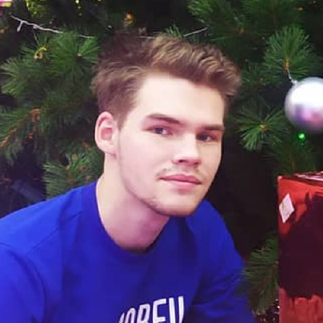

# Aleksandr Altarev

## Contact info

* **Email**: (altarev123456@mail.ru)[altarev123456@mail.ru]
* **VK**: (Aleksandr Altarev)[https://vk.com/alaisev]
* **GitHub**: (Alaicev)[https://github.com/Alaicev]
* **Telegram**: (+7 (902) 028 81-21)[89020488121]


## About me

Completely passed the course "RS-school stage 0". On the course, I performed tasks "Portvolio", tic-tac-toe audio player
and a quote generator. 

I want to become a professional front-end developer in order to realize myself in the future. Purposeful and responsible


## Skills

### Program

* VSCode
* WebStorm

----------------------------------------------------------------

### Programming languages

* HTML 
* CSS 
* JavaScript (Below the average)


### Example code

```JavaScript

module.exports = function towelSort (matrix) {
  let rezult = []

  if ( matrix != undefined) {

    for(let i = 1; i <matrix.length; i +=2){
        matrix[i].reverse()
    }
      for(let items of matrix){
          for(let item of items) {
              rezult.push(item)
          }
      }
      return rezult
  }
  return []
}
```


## Junior Dev 

* (Portfolio)[https://rolling-scopes-school.github.io/alaicev-JSFEPRESCHOOL/portfolio/]
* (tic-tac-toe)[https://rolling-scopes-school.github.io/alaicev-JSFEPRESCHOOL/tic-tac-toe/]
* (audio-player)[https://rolling-scopes-school.github.io/alaicev-JSFEPRESCHOOL/audio-player/]
* (random-jokes)[https://rolling-scopes-school.github.io/alaicev-JSFEPRESCHOOL/random-jokes/]


## Education 

* (HTML Academy)[https://htmlacademy.ru/program]: Progress - 100%
* (Score JS/FE Pre-School 2022)(https://app.rs.school/): progress - 100%


## Language

**English language**: Lol level/below the average level
